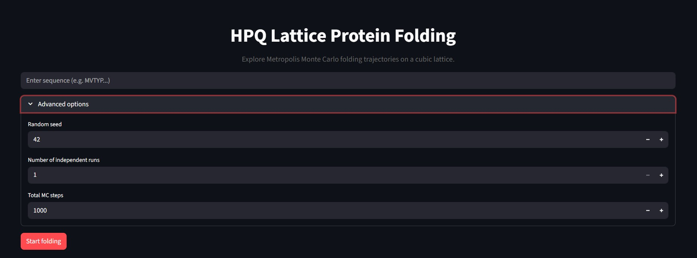
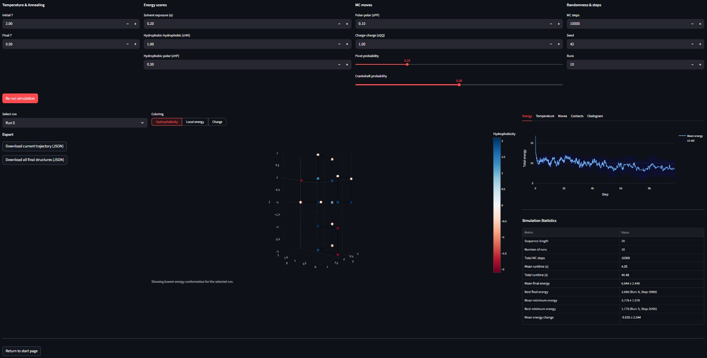

# HPQ Lattice Protein Folding Model

This tool implements a simplified lattice-based protein folding simulation using the HPQ model, combining:
- **Monte Carlo sampling** with Metropolis acceptance for conformational exploration
- **HPQ energy model** incorporating hydrophobicity, polarity, and electrostatic interactions
- **Cubic lattice constraints** for simplified spatial representation
- **Interactive Streamlit UI** for real-time simulation control and visualization

## Biology/Chemistry Background

### What does this tool do?

Proteins fold into specific three-dimensional structures to perform their biological functions. The protein folding problem involves predicting how a linear sequence of amino acids adopts its native conformation. This is computationally challenging due to the vast conformational space.

This simulation uses a lattice model where:
1. **Amino acids are placed on a cubic lattice** with simplified spatial constraints
2. **Energy calculations drive folding** based on hydrophobic effects, polar interactions, and charges
3. **Monte Carlo sampling explores conformations** using Metropolis criterion
4. **Temperature annealing** helps escape local minima to find lower-energy structures

### Key Concepts

- **Hydrophobic effect**: Non-polar (hydrophobic) amino acids tend to cluster together away from water, driving protein folding
- **Lattice models**: Simplified representations where amino acids occupy discrete lattice points, reducing computational complexity
- **HPQ model**: Three-state model where amino acids are classified as Hydrophobic (H), Polar (P), or charged (Q)
- **Monte Carlo methods**: Stochastic sampling techniques to explore conformational space
- **Metropolis algorithm**: Acceptance criterion for moves based on energy differences and temperature

## Mathematics

### Energy Model

The total energy $E$ of a conformation consists of two components:

1. **Contact energy** ($E_{contact}$): Interactions between adjacent residues
2. **Solvent exposure energy** ($E_{solvent}$): Penalty for hydrophobic residues exposed to solvent

$$E = E_{contact} + E_{solvent}$$

#### Contact Energy

For each pair of non-sequential adjacent residues $(i,j)$:

- Hydrophobic-hydrophobic contact: $E_{HH} = -\epsilon_{HH}$ (favorable)
- Hydrophobic-polar contact: $E_{HP} = +\epsilon_{HP}$ (unfavorable)
- Polar-polar contact: $E_{PP} = -\epsilon_{PP}$ (favorable)
- Opposite charge contact: $E_{QQ} = -\epsilon_Q$ (favorable)
- Same charge contact: $E_{QQ} = +\epsilon_Q$ (unfavorable)

Where $\epsilon_{HH} = 1.0$, $\epsilon_{HP} = 0.3$, $\epsilon_{PP} = 0.1$, $\epsilon_Q = 1.0$

#### Solvent Exposure Energy

For each hydrophobic residue ($H > 0$), exposed to solvent:

$$E_{solvent} = \alpha \cdot H \cdot (6 - n_{neighbors})$$

Where:
- $\alpha = 0.2$ (scaling factor)
- $H$ is the hydrophobicity score
- $n_{neighbors}$ is the number of occupied adjacent lattice sites (0-6)

### Monte Carlo Sampling

The Metropolis algorithm generates a Markov chain of conformations:

1. Propose a random move (pivot, crankshaft, end, or corner move)
2. Calculate energy change $\Delta E = E_{new} - E_{old}$
3. Accept move with probability:
   - $P_{accept} = 1$ if $\Delta E \leq 0$
   - $P_{accept} = e^{-\Delta E / kT}$ if $\Delta E > 0$

Temperature annealing from $T_{start} = 2.0$ to $T_{end} = 0.5$ helps explore conformational space.

*All constant variables can be customized in the UI.*

## Model Aspects

### HPQ Classification

Amino acids are classified using modified Kyte-Doolittle hydrophobicity scores divided by 2:

- **Hydrophobic (H > 0)**: scores: 0.90 to 2.25
- **Polar (H < 0)**: scores: -2.25 to -0.20
- **Charged (Q ≠ 0)**: scores: -1 or +1

### Lattice Representation

- **Cubic lattice**: Residues occupy integer coordinates (x,y,z)
- **Self-avoiding walk**: No two residues occupy the same lattice site
- **Bond constraints**: Sequential residues must be adjacent (face-connected)
- **Initial conformation**: Zigzag pattern along x-axis with alternating y-coordinates

### Monte Carlo Moves

Four types of moves maintain chain connectivity:
- **End moves**: Move terminal residues to adjacent free sites
- **Corner moves**: Move interior residues diagonally when adjacent to both neighbors
- **Pivot moves** (25% probability): Rotate chain segments around pivot points
- **Crankshaft moves** (50% probability): Rotate two adjacent residues around their bond

## Installation

### Requirements
- Python 3.8+
- Dependencies listed in `requirements.txt`

### Setup

```bash
pip install -r requirements.txt
```

## Usage

### Running the Application

```bash
streamlit run app.py
```

This launches the interactive Streamlit GUI at `http://localhost:8501`.

### Input

#### Peptide Sequence
Enter amino acid sequence using single-letter codes:

- H: Hydrophobic residues (A, I, L, M, F, V, C, P, G, W)
- P: Polar residues (S, T, Y, N, Q)
- Q: Charged residues (R, D, E, H, K)

#### Configuration Parameters

- **Random seed**: For reproducible simulations
- **Number of runs**: Independent Monte Carlo trajectories (1-1000)
- **MC steps**: Total Monte Carlo steps per run (100-100000)
- **Temperature range**: Start/end temperatures for annealing

### Output

#### Simulation Results

1. **Trajectory data**: Energy vs. step for each run
2. **Final structures**: Lowest-energy conformations
3. **Contact maps**: Residue-residue interaction matrices
4. **Energy statistics**: Min, max, average energies across runs

#### Interactive Visualizations

The workspace provides multiple analysis views:

| Tab | Visualization | Info |
|-----|---|---|
| **Trajectory** | Energy vs. time plots | Convergence and sampling quality |
| **Structure** | 3D lattice conformation | Folded protein structure |
| **Contacts** | Heatmap matrix | Residue interaction patterns |
| **Energy** | Distribution histograms | Energy landscape exploration |
| **Moves** | Move type frequencies | Sampling efficiency |

#### Downloads

- **Trajectory CSV**: Time series of energies and structures
- **Structure JSON**: Final conformations in structured format
- **Statistics CSV**: Summary metrics across runs

## Project Structure

```
hpq_lattice_model/
├── core/                    # Core simulation logic
│   ├── simulation.py       # Monte Carlo simulation runner
│   ├── config.py          # Default parameters
│   └── validation.py      # Input validation
├── folding/                # Folding algorithms
│   ├── energy.py          # HPQ energy calculations
│   ├── moves.py           # Monte Carlo move types
│   └── relax.py           # Annealing and relaxation
├── model/                  # Data structures
│   ├── chain.py           # Peptide chain representation
│   ├── cube.py            # Individual residue
│   └── lattice.py         # 3D cubic lattice
├── ui/                     # Streamlit interface
│   ├── state.py           # Session management
│   ├── pages/
│   │   ├── landing.py     # Input/configuration page
│   │   └── workspace.py   # Results/analysis page
│   └── panels/            # UI components
├── analytics/              # Analysis and statistics
│   ├── statistics.py      # Energy and trajectory stats
│   └── trajectories.py    # Trajectory processing
├── plots/                  # Visualization components
│   ├── contacts.py        # Contact map plots
│   ├── energy.py          # Energy plots
│   ├── lattice.py         # 3D structure plots
│   └── temperature.py     # Temperature plots
├── utils/                  # Utilities
│   └── io.py              # File I/O helpers
├── data/                   # Static data
│   └── residues.json      # Amino acid properties
└── app.py                  # Main entry point
```

## Implementation Details

### Energy Calculation

- `EnergyModel.compute_contact_energy()`: Sum pairwise interactions for adjacent non-sequential residues
- `EnergyModel.compute_solvent_energy()`: Calculate exposure penalty for hydrophobic residues
- Total energy computed efficiently by updating only affected terms during moves

### Monte Carlo Moves

- **End moves**: Simple terminal residue repositioning
- **Corner moves**: Diagonal moves for chain flexibility
- **Pivot moves**: Segment rotation maintaining chain connectivity
- **Crankshaft moves**: Local crankshaft rotations

### Annealing Schedule

Linear temperature decrease from $T_{start}$ to $T_{end}$ over total steps, with Metropolis acceptance at each temperature.

## User Interface

### Landing Page
- Sequence input with validation
- Parameter configuration sliders
- Advanced options expander
- "Start folding" button




### Results Workspace
- Summary statistics tables
- Interactive 3D structure viewer
- Trajectory plots with zooming/panning
- Contact matrix visualization
- Download buttons for data export




## Example Workflow

1. **Input sequence**: Enter desired peptide sequence (e.g., "METPVVPIIPKL")
2. **Configure**: 10 runs, 10000 steps, seed=42
3. **Run simulation**: View 3D structures, energy distributions, contact patterns
4. **Download data**: Export trajectories and statistics

## Performance

- **Time complexity**: $O(n \cdot s)$ where $n$ is sequence length, $s$ is MC steps
- **Space complexity**: $O(n)$ for lattice and chain storage
- **Typical runtime**: ~1 second per run for 20-residue sequences with 10k steps
- **Scalability**: Linear scaling with sequence length and MC steps